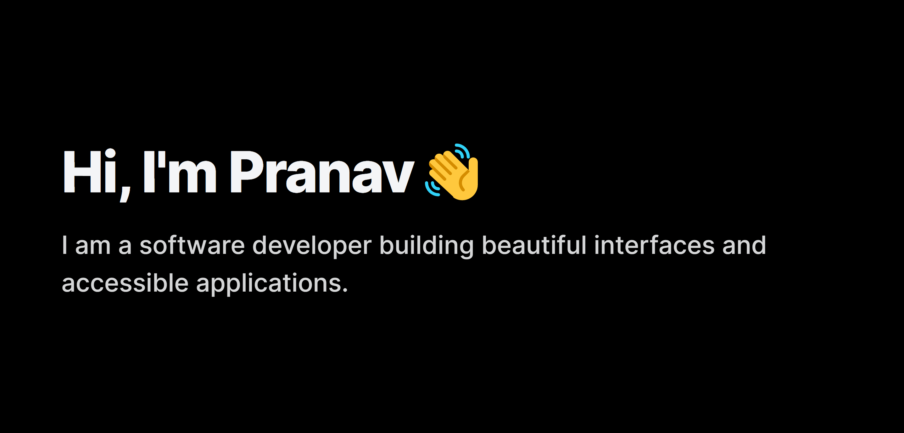



Hello! I'm [Pranav](https://pranavbirajdar.com) 👋, a software developer based in Toronto, CA🍁. I’m a front-end developer with experience building performant and accessible applications.

- 👨 Pronouns: He/Him
- 👨‍💻 I'm currently learning TypeScript with React and Server-side GraphQL
- ✍️ I write and post articles on my [website](https://pranavbirajdar.com/blog) and [DEV.to](https://dev.to/prnvbirajdar)
- ⚡ Fun fact about me: I'm a mechanical engineer turned personal trainer turned software developer
- 📫 How to reach me: [@prnvbirajdar](https://twitter.com/prnvbirajdar)

Want to know more? [Check out my website](https://pranavbirajdar.com).

## 📌 Pinned Repositories

 
 

## 🧰 Technologies and Tools

 

 

## 📈 GitHub Stats

 
